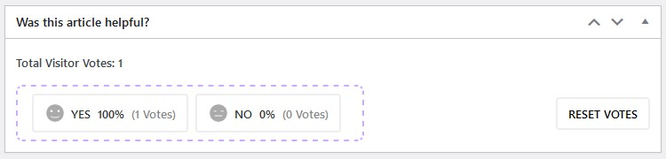

# WordPress Plugin: _helpful-posts_ 

This assesment was part of a coding test posted at HackerRank by Find.co, as part of a Senior WP Developer hiring process. The code is released under the [GNU General Public License](https://www.gnu.org/licenses/gpl-3.0.en.html).

### Task Overview: “Was this article helpful?”

In this task, your objective is to develop an OOP WordPress plugin that allows website visitors to vote on various articles. Your goal is to create a user-friendly, efficient, and secure plugin that integrates seamlessly with WordPress websites.

### Requirements

### 1. Plugin description and functionality:

* Implement a simple voting system with two actions (buttons) - `Yes` and `No`. Each one will add a “Positive” or “Negative” count to the voting results. Show the voting results as an average percentage. Use an Ajax request to submit the visitor's vote.
* Once, the visitor votes, he will be able to see the voting results in average percentage, and the buttons will remain inactive, but also will show your vote (even if you refresh the page).
* Prevent visitors from voting twice on the same article, using the visitor's fingerprint (like checking his IP address).
* Display the voting feature at the end of any single post article, automatically.
* Ensure that the voting elements are responsive and work well on various devices and screen sizes.

### 2. Front End:

* Design: Below, you can see the design that you should aim to achieve on the front-end.

### 3. Admin Functionality:

* Post Edit: When we edit an article from the admin area, we should be able to see the voting results, in a meta widget.
* Extra: Add a button to clear votes and user IPs from the database for that post.

### 4. Documentation:

* User Guide: Create comprehensive documentation for users on how to install, configure, and use the plugin.
* Code Comments: Provide clear and well-documented code with inline comments to explain the functionality and logic.

### 5. Testing:

* Functional Testing: Thoroughly test the plugin's functionality to ensure it works as expected.
* Evaluation Criteria
  * Code quality and organization.
  * User-friendliness and design of the user interface.
  * Security measures and data protection.
  * Compliance with WordPress coding standards.
  * Documentation quality.
  * Successful completion of all specified features and requirements.

### 6. Installation

* Clone the assessment repository, and create a public one. (Do not fork it).
* Follow the project installation guide [Docker & Docker Compose](https://github.com/nezhar/wordpress-docker-compose)

